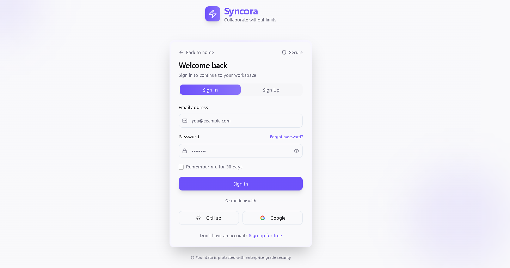
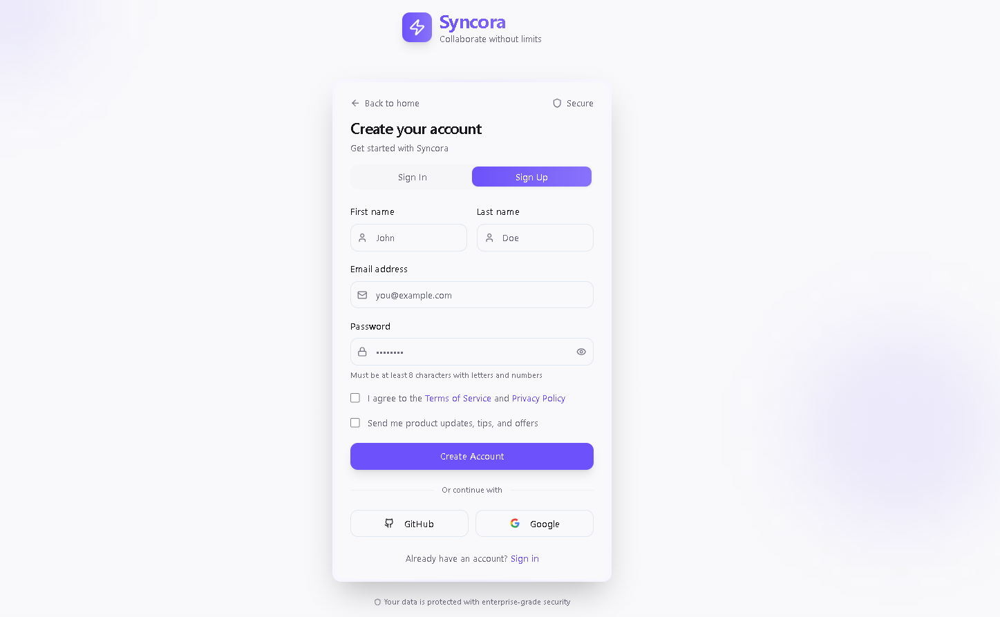
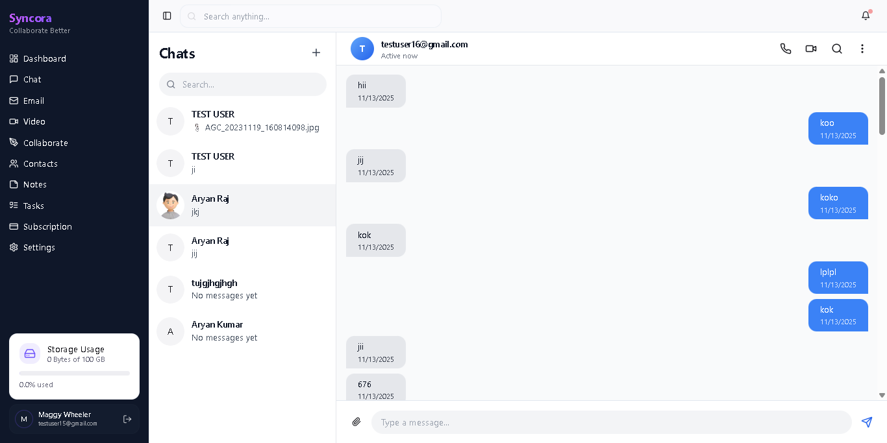
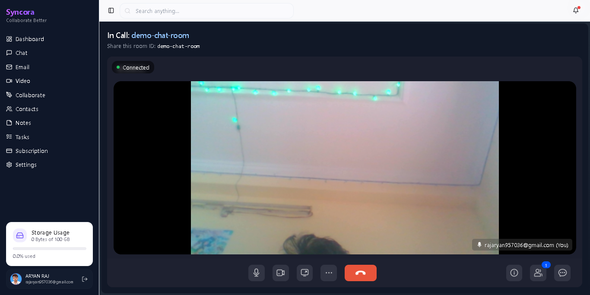
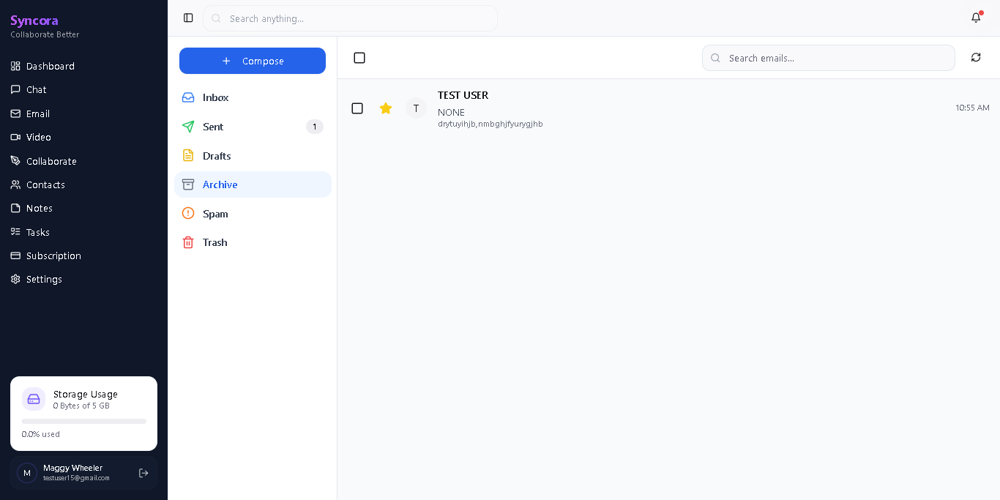

# Syncora 🚀

**Syncora** is a modern, collaborative productivity platform that unifies real‑time communication and team workflows into a single ecosystem. It brings together chat, voice/video calls, notes, tasks, whiteboard, contacts, subscriptions, and email—powered by a robust Spring Boot backend and a high‑performance React + TypeScript frontend.

> ⚡ Fast developer setup · Clear environment configuration · Production‑ready architecture

---


---

## 📌 Overview

Syncora is designed for teams that need real‑time collaboration without context switching. The platform combines synchronous communication (chat, voice, video, whiteboard) with asynchronous productivity tools (notes, tasks, email, subscriptions) in a single, scalable system.

The architecture follows a clean separation of concerns:

* **Backend**: Spring Boot REST APIs, WebSockets, SQL schema management, optional HTTPS
* **Frontend**: React SPA with Vite, TypeScript, Tailwind CSS, and context‑driven state management

---

## ✨ Core Features

* **Real‑time Chat**: Ably-Based chat messaging with low latency
* **Voice Calls**: One‑to‑one voice communication using Ably signaling
* **Video Conferencing**: Live video calls via ZegoCloud SDK
* **Notes & Tasks**: Personal and shared productivity modules
* **Whiteboard**: Collaborative drawing and ideation (Excalidraw‑style UX)
* **Contacts**: Team member management and invitations
* **Subscriptions**: Plan management and usage tracking
* **Email Module**: Schema‑backed email functionality

---

## 🛠️ Tech Stack

**Frontend**

* React 18 + TypeScript
* Vite
* Tailwind CSS

**Backend**

* Java 17 (LTS)
* Spring Boot 3.x
* REST APIs & WebSockets

**Database**

* PostgreSQL or MySQL

**Realtime & Media**

* WebSockets
* Ably (voice signaling)
* ZegoCloud (video conferencing)

---

## 🗂️ Monorepo Structure

```
SYNCORA/
├─ pom.xml
├─ mvnw / mvnw.cmd
├─ src/
│  ├─ main/
│  │  ├─ java/com/...           # Spring Boot source code
│  │  └─ resources/             # Properties, SQL schemas, migrations
│  │     ├─ application.properties
│  │     ├─ application-local.properties
│  │     ├─ schema.sql, data.sql
│  │     ├─ subscription-schema.sql
│  │     └─ db/migration/
│  └─ test/java/com/...         # Backend tests
├─ target/                      # Maven build output
├─ syncora-https-keystore.p12   # Optional HTTPS keystore
├─ syncora_frontend/            # React + Vite frontend
│  ├─ src/
│  │  ├─ api/                   # Axios API clients
│  │  ├─ components/            # Reusable UI components
│  │  ├─ contexts/              # Auth, Chat, Video contexts
│  │  ├─ hooks/                 # Custom hooks
│  │  ├─ pages/                 # Route pages
│  │  └─ websocket/             # WebSocket helpers
│  └─ vite.config.ts
```

---

## 🖼️ Screenshots

<p align="center"></p>
<p align="center"></p>
<p align="center"></p>
<p align="center"></p>
<p align="center"></p>
<p align="center"></p>

---

## ⚙️ Prerequisites

* Java 17+
* Maven 3.9+
* Node.js 18+ (or Bun)
* PostgreSQL or MySQL
* Docker (optional)

---

## ▶️ Running Locally

### Backend

```powershell
.\mvnw.cmd spring-boot:run -Dspring-boot.run.profiles=local
```

Default backend URL: `http://localhost:8080`

### Frontend

```powershell
cd syncora_frontend
npm install
npm run dev
```

Default frontend URL: `http://localhost:5173`

---

## 🐳 Optional: PostgreSQL via Docker

```powershell
docker run --name syncora-postgres \
  -e POSTGRES_USER=syncora \
  -e POSTGRES_PASSWORD=secret \
  -e POSTGRES_DB=syncora \
  -p 5432:5432 -d postgres:16
```

---

## 🏗️ Build & Production

**Backend**

```powershell
.\mvnw.cmd -DskipTests package
java -jar target/syncora-*.jar --spring.profiles.active=prod
```

**Frontend**

```powershell
npm run build
```

Production assets are generated in `syncora_frontend/dist/`.

---

## 🔐 Security Notes

* Do not commit real API keys or secrets
* Use environment variables and secret managers in production
* Enable HTTPS and secure WebSocket connections

**Hardening Checklist**

* Enforce HTTPS + HSTS
* Rate‑limit authentication endpoints
* Sanitize chat and note inputs
* Secure and rotate third‑party SDK keys

---

## 🤝 Contributing

* Fork the repository and create feature branches
* Keep commits small and focused
* Follow Conventional Commits (`feat:`, `fix:`, `docs:`)

---

## 📄 License

This project is currently under active development. Licensing details will be added soon.
